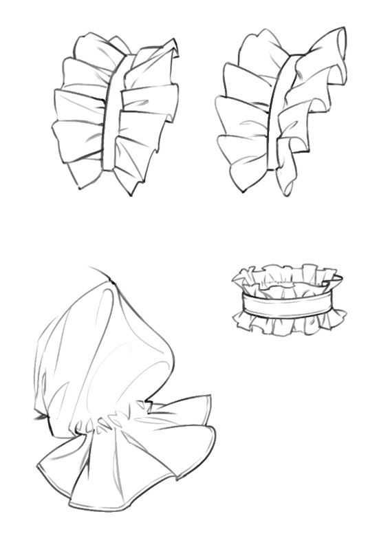
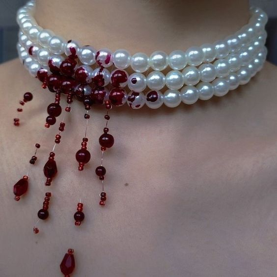
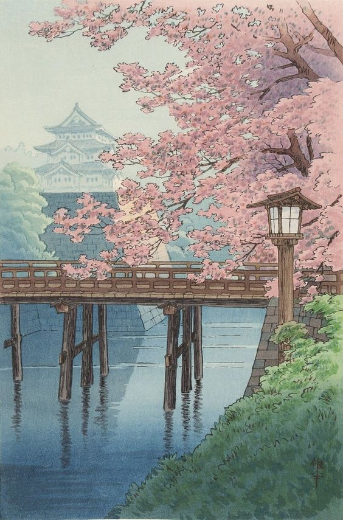
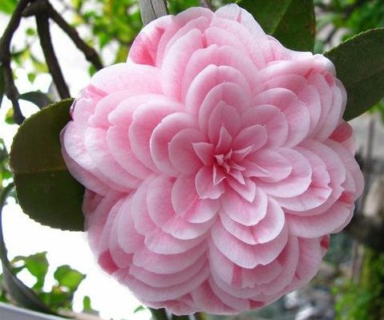
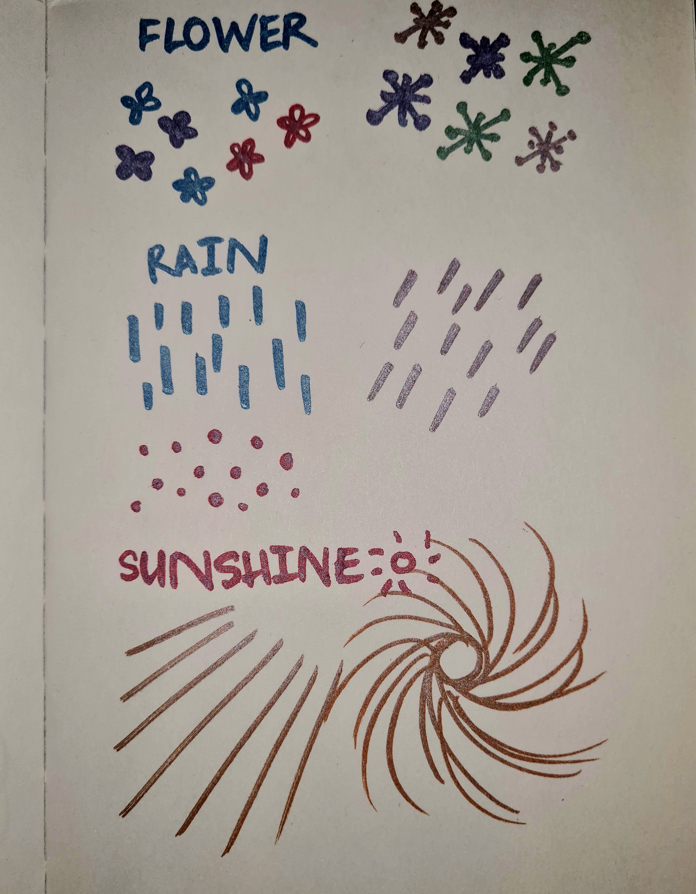

# Ideation

I started off by looking at the references given on the assignment page. Out of all of them, I was heavily inspired by the Tyler Hobbs one. When I knew that I needed to use either interaction or music in my piece, I decided to create generative art by interations with the keyboard and mouse.
I struggled to choose a theme for my art, because I had so many options. I decided to get on Pinterest and picked random pictures to be my source of inspiration. Here are the pictures I chose:

From these pictures, I just drew anything that popped up in my mind onto my sketchbook, and here is what I got:

The idea that stood out the most for me was the flower under both the sun and the rain. Here are some variations I made for each element:

I made the flowers using seperate ellipses, the rain using rectangles, and the sun rays using [parametric equations](https://p5js.org/examples/math-parametric-equations.html).

Next, I looked for tutorials on creating repetitive patterns with JavaScript/p5.js on YouTube. The videos that helped me the most with understanding how to create them were [Making Simple Pattern in p5.js](https://www.youtube.com/watch?v=ig0q6vfpD38) and [Patterns In Nature - Explosion Algorithm (P5JS Tutorial)](https://www.youtube.com/watch?v=B1prjzjtwLY). I also explored other people's p5.js sketches to see what I would be capable of doing with my sketch.

<iframe width="400" height="442" src="https://editor.p5js.org/Luxapodular/full/fla_YPt14"></iframe>

The [p5.js examples](https://p5js.org/examples/) website was a great source of inspiration. By looking through all examples, I had a much better understanding of what to use to achieve the result that I wanted. The [Game of Life](https://p5js.org/examples/simulate-game-of-life.html) was the most influential for me.

What I wanted to do was to create a game-like generative art piece: when you click or press different buttons, different things show up, and with music included. 