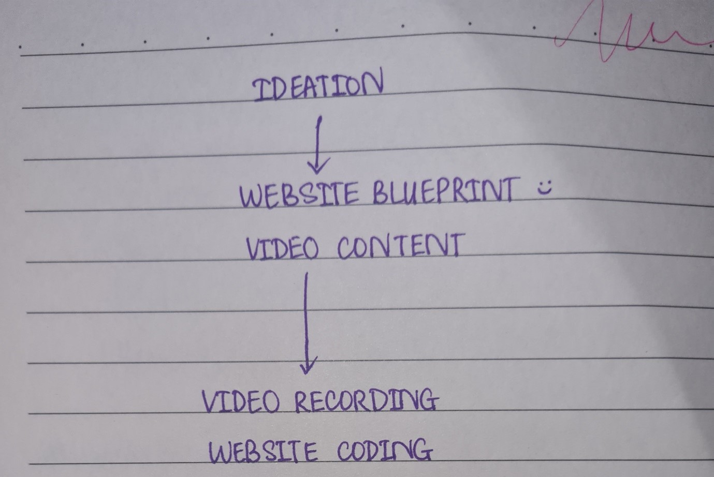
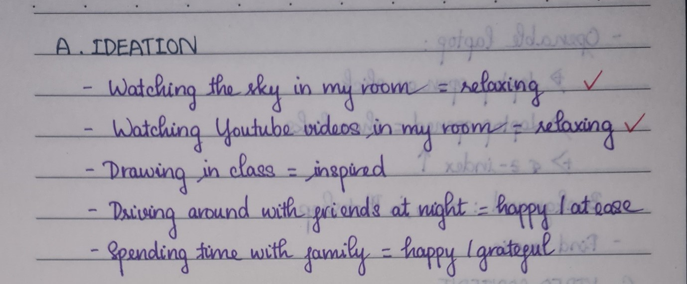
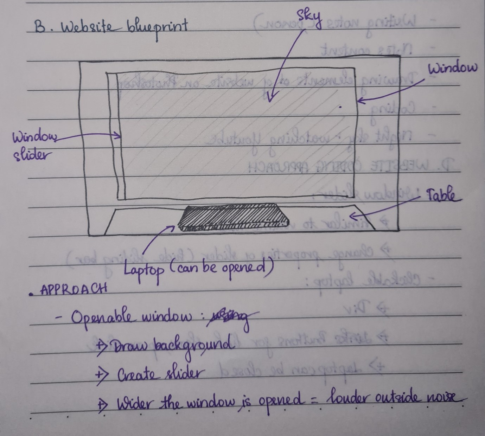
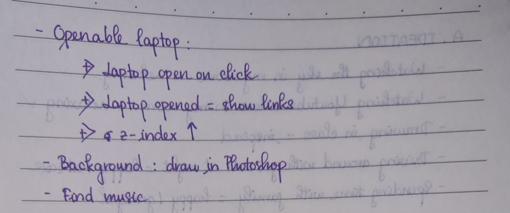

# Ideation

I started out with making a plan on how I would approach this project.

Then, I named all the experiences that are valuable and personal with me, and the emotions that come with them.

There are a few reasons why I chose these two experiences:
o I would be able to record my experience effectively.
o These two experiences go hand in hand: I usually stay up late at night watching YouTube videos. The videos I want to portray in my projects are LED gloving light show videos. For some reason, these videos are very soothing and calming to my ADHD brain. 
o I am capable of executing my idea with my code.
o I considered choosing spending time with my family, but my family is living in another country so I wouldn’t be able to record effectively.

Some examples of the videos I watch are [Circus Lights by StatusSilver](https://www.youtube.com/watch?v=4uafkkjy-EU) and [Tranquil by EmazingLights](https://youtu.be/033pEmNiRP8).

As I chose two experiences, my project would basically consist of 2 smaller projects: one about my surroundings when I watch the sky, and one about my experience with watching the videos.

For the first project, I want to make an openable window and a laptop to interact with. The window will also act as a volume slider for the night sounds. I also would like to create all the elements myself (except for the sound), so I decided to draw a simple background and the laptop with Photoshop.

Websites that helped me a lot with this project are [Image Comparison Slider Tutorial by CodingNepal](https://youtu.be/7O3rEaZ_iUU), [Generative Art with Vanilla JavaScript by Franks laboratory](https://www.youtube.com/watch?v=0v4_Dw0K8pw&t=79s) and [Sketching with HTML5 Canvas and “Brush Images”](http://tricedesigns.com/sketching-with-html5-canvas-and-brush-images/).

<iframe
    width="640"
    height="480"
    src="https://youtu.be/7O3rEaZ_iUU"
    frameborder="0"
    allow="autoplay; encrypted-media"
    allowfullscreen
>
</iframe>

For my second project, I created three different smaller projects to describe three different experiences of mine. My website is basically a canvas, which allows the user to interact with different brushes and create their own piece of art, just like how the LED created art in front of my eyes:
o The first project – called “Laser beam” - portrays the lights of different colours fading in and out of the darkness. It was the physical representation of what I saw in the performance. The lights were of different colours and sizes and moved so smoothly like a paintbrush. There are trails of light fading after the laser beams, and after the trail fades out on the canvas, you can see a faint afterimage, portraying the afterimage I saw after seeing the bright beams on a completely dark background.
o The second project – called “Normal canvas” – is meant to portray the mental images that I associated with as I witnessed the work of art. It was not to fade away, but to be stuck in my mind, hence the reason why the brush strokes in this project stayed instead of fading away like the first project. The titles for the buttons are inverted as if these images were being projected from my mind.
o The last project – called “Stars” – was a representation of the afterimages I saw when the LED lights disappeared and the whole room fell into darkness. Have you ever been in a very dark room and suddenly something extremely bright shone in your eyes, and when you blink there would be afterimages of that light floating around? That was what I was experiencing, however, it was a much more surreal experience. I could remember very vividly how the room fell into darkness and I was just in my own world. Every time I blink, there would be sparkly dots of light floating on the black background, and as I kept blinking, they would multiply and branch out. Similar to my first project, the brush strokes would slowly fade out, just like how these dots slowly disappeared if I kept my eyes open for too long. I chose not to include any elements on this canvas to demonstrate how I felt like I was in a completely different dimension at that moment, disconnected from everything around me.

It was quite convenient because my second project was meant to be a project inspired by what I made in Assignment 2. I made it since I got pretty low grade in Assignment 2 and wanted to improve my knowledge on JavaScript. This is also why I created this project with pure JavaScript.

I had little references for this project because this project feels personal to me, and I would like to be able to work on it on my own and take the JavaScript knowledge I learnt to the test.