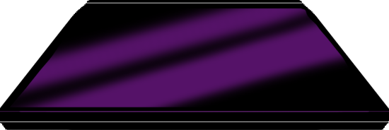

# First project

## Integrating the volume slider with the window slider.

I drew 2 background images, one with a purple tinted window, and one without a window. The idea is to create an image comparison slider between these two images, but the only difference is the city background, and the slider would imitate a window opening and closing.


I created 2 variables called `sliderVal` - responsible for changing between the 2 images and imitating a window opening and closing – and `windowSound` – responsible for changing the volume of the night sounds
I’m not sure how to word this, but since the value of the drag line is in %, in the js file, `dragLine.style.left` needs "%" string. Same goes for the volume: since the value of the volume only goes from 0 to 1, windowSound needs "0." string.

## Creating the button to change the state of the laptop

I drew 2 versions of the laptop: one opened and one closed.




I removed the background of the drawing and make them png files so that the image only consists of the laptop

Initially, my idea was to stack both images in one button, and whenever I click on the button, the image would change. I created the variable `laptopOpen` and make it false, and the function `laptopChange()`. Giving the images the ids "laptopimg" and "laptopopened":

```js
laptop.addEventListener("click",(e) => {laptopChange()});

function laptopChange() {
    if (laptopOpen == false) {
        laptopimg.style.display = 'none';
        laptopopened.style.display = 'inline-block';
    }
}
```
However, since the sizes of the images were different, the image for the laptop opened image was cropped inside the button (the original size of the button is the size of the laptop closed image). I tried to fix that by changing the size of the button as it is clicked, using buttonName.style.width and height, however, the position of the button needed to be changed too. 

I decided to create 2 separate buttons instead, with their properties assigned in the css file, and the ids laptop and laptopopened. As laptop is clicked, it disappears and laptopopened would appear, and vice versa:

```js
function laptopChange() {
    if (laptopOpen == false) {
        laptop.style.display = 'none';
        laptopopened.style.display = 'inline-block';
    }
}
laptopopened.addEventListener("click",(e) => {laptopDefault()});

function laptopDefault() {
    if (laptopOpen == false) {
        laptop.style.display = 'inline-block';
        laptopopened.style.display = 'none';
   }
}
```

A problem that is unresolved of this website is how it operates differently on different browsers. For me, using Google Chrome requires me to zoom out to 67%, and the website works as intended, however, for my friend, using Firefox requires them to zoom out to 50%, and there is a white dot following the slider. I'm not sure how to fix this problem yet.


# Second project

## Laser beam and normal canas

Both canvases are practically the same. The differences are that:
• Laser beam has a canvas that “deletes” itself as the mouse moves, to create the fading afterimages. I did it by filling the black canvas with reduced opacity layer of black every time the mouse moves:

```js
canvas.addEventListener('mousemove', function() {
    //This is used instead of clearRect because clearRect would make the circles disappear but the branches still spreads out after they disappear.
    ctx.fillStyle = 'rgba(0,0,0,0.03)';
    ctx.fillRect(0, 0, canvas.width, canvas.height);
});
```

• Normal canvas retains the brush strokes, but requires an eraser. I made the eraser by making a brush with the same color as the background.

A problem I faced with the brushes is that after I use the hue brush, the next brush I choose would inherit the brush size value of the last point of the hue brush stroke, instead of the value on the brush size slider. To fix the problem, I make it so that whenever a brush that is not hue brush is selected, the brush size would be set to the value on the brush slide slider:

```js
 if (brush == 'hue') {
    etc.
}
  else {
      newBrushsize(strokeWidthSlider.value); //So that the brush size is the value on the slider, not the value of the last point of the stroke of hue brush.
  }
```

## Star canvas

I watched a tutorial to create this brush, because it goes so well with the idea I had in mind. It was quite difficult to understand some parts at first, but I wanted to understand what I was doing, that’s why there are so many comments in the js file.

# Video process

## Plans on what to record:
• The surroundings of my experience

• My reactions when I’m in the experience

• Coding and drawing process

## Difficulties

• This was probably the most difficult part for me, since I’m generally very awkward in front of cameras, and I have no idea what to include in my video.

• My room is very small, and I had really little space to put my phone, so a lot of the time the camera is too awkwardly close to the laptop screen or my face. However, I needed to record in my room because it is the only place I feel truly comfortable.

• My experience is supposed to be relaxing, but when I’m relaxed, my face looks extremely expressionless. I took a look at the video of me in that experience and it was literally me having one expression throughout the whole video ): 

• I tried, but have no idea how to record my reactions when I code. When I successfully debug my code, I just awkwardly looked at the camera and gave a thumbs up LOL


